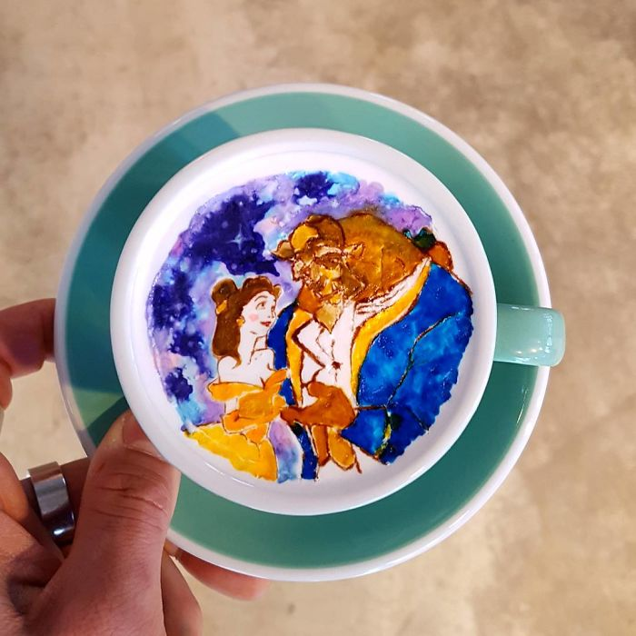

# CoffeeShopTemplate

Simple coffee shop template using CSS and HTML

## Costomize

You can costomize the template as you want.

- ### Colors

If you want use costom color, you can change the root variables.  

Original:
```
:root{
    --primary-color:#b2744c;
    --secondary-color:#D5CEA3;
    --tertiary-color:#e4e0d9;
}
```
Costom:
```
:root{
    --primary-color:#E55807;
    --secondary-color:#7E1717;
    --tertiary-color:#ECF8F9;
}
```
- ### Images & Media

The images are in the `img/` folder. Videos are in the `video/` folder. 
You can replace costom image and video files in these folders.
After replace the files change source of images from HTML file. 

original:
```

```
costom:
```

```

- ### Embeded Video

There is an embedded YouTube video in the art section. Choose a video from Youtube and copy the embed code. Then change the source of `iframe` tag.  

Original:
```
<iframe width="907" height="498" src="https://www.youtube.com/embed/HgfjZ4SWJxk" title="Latte art heart skills" frameborder="0" allow="accelerometer; autoplay; clipboard-write; encrypted-media; gyroscope; picture-in-picture; web-share" allowfullscreen></iframe>
```
Costom:
```
<iframe width="885" height="498" src="https://www.youtube.com/embed/cJksu8XxZCo" title="Sertab Erener - Everyway That I Can (Turkey - Final - Eurovision Song Contest 2003)" frameborder="0" allow="accelerometer; autoplay; clipboard-write; encrypted-media; gyroscope; picture-in-picture; web-share" allowfullscreen></iframe>
```
